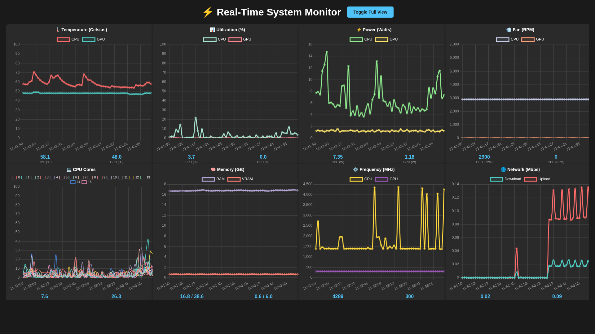

# Real-Time System Monitor Dashboard

> **⚠️ DEPRECATED - No Longer Deployed**
> 
> This Docker-based system monitor has been **removed from production**. The infrastructure has migrated to:
> - **[k8s-fips-homelab](https://github.com/qu4n/k8s-fips-homelab)** - FIPS-compliant Kubernetes cluster
> - Future monitoring will use **Prometheus + Grafana** in Kubernetes
> 
> **This application is no longer running** but preserved for reference.
> 
> If you want to deploy monitoring, consider using:
> - [kube-prometheus-stack](https://github.com/prometheus-operator/kube-prometheus) for Kubernetes
> - [Netdata](https://github.com/netdata/netdata) for lightweight system monitoring
> 
> ---

A beautiful, real-time system monitoring dashboard with live charts for CPU, GPU, memory, network, and more. Built with Flask and Chart.js, running in Docker.


## Screenshot



*Full view mode showing all 8 real-time monitoring charts*

## Features

### 📊 8 Real-Time Charts (60-second history, 1-second updates)

1. **🌡️ Temperature (Celsius)** - CPU & GPU temperatures (0-100°C)
2. **📊 Utilization (%)** - CPU & GPU usage (0-100%)
3. **⚡ Power (Watts)** - CPU & GPU power consumption
4. **💨 Fan (RPM)** - CPU & GPU fan speeds (0-7000 RPM)
5. **💻 CPU Cores** - Per-core usage for all CPU cores (0-100%)
6. **🧠 Memory (GB)** - System RAM & GPU VRAM usage
7. **⚙️ Frequency (MHz)** - CPU & GPU clock speeds
8. **🌐 Network (Mbps)** - Upload & download speeds

### ✨ Key Features

- **Full View Mode (Default)** - 4×2 grid showing all 8 charts on one screen
- **Toggle View** - Switch between full view and scrollable layout
- **Clean Legend Labels** - Simplified legends (e.g., "CPU"/"GPU" instead of "CPU Temp"/"GPU Temp")
- **Fixed Y-Axes** - Consistent scales for easy comparison
- **Dark Theme** - Easy on the eyes for long monitoring sessions
- **No External Dependencies** - All data from system commands (`sensors`, `nvidia-smi`, `/proc`, etc.)

## Requirements

- **Docker** (with `--gpus` support for NVIDIA GPU monitoring)
- **NVIDIA GPU** (optional, but required for GPU metrics)
- **Linux Host** (tested on Ubuntu, should work on most Linux distros)

## Quick Start

### Using Docker Compose (Recommended)

```bash
# Clone the repository
git clone https://github.com/qu4n/system-monitor-dashboard.git
cd system-monitor-dashboard

# Build and start
docker compose up -d --build

# Access dashboard at http://localhost:5000
```

### Using Docker CLI

```bash
# Build
docker build -t system-monitor .

# Run
docker run -d \
  --name system-monitor \
  --privileged \
  -v /sys/class/powercap:/sys/class/powercap:ro \
  --gpus all \
  -p 5000:5000 \
  system-monitor

# Access dashboard at http://localhost:5000
```

## What's Monitored

### CPU Metrics
- **Temperature** - From `lm-sensors` (Tctl/Tdie)
- **Usage** - Overall CPU utilization via `top`
- **Per-Core Usage** - Individual core usage via `mpstat`
- **Frequency** - Current clock speed from `/proc/cpuinfo`
- **Fan Speed** - CPU fan RPM from `sensors`
- **Power Draw** - Intel RAPL energy consumption

### GPU Metrics (NVIDIA)
- **Temperature** - GPU temperature in Celsius
- **Utilization** - GPU usage percentage
- **Power Draw** - GPU power consumption in Watts
- **Fan Speed** - GPU fan RPM
- **Frequency** - GPU clock speed in MHz
- **VRAM Usage** - Video memory used/total

### System Metrics
- **RAM Usage** - System memory used/total
- **Network Traffic** - Total upload/download speeds (all interfaces except loopback)

## Technical Details

### Backend (`app.py`)
- **Flask** - Lightweight web server
- **Data Collection** - Background thread collecting metrics every second
- **API Endpoint** - `/api/data` returns JSON with 60 seconds of history
- **Sources**:
  - `sensors` - Temperature and fan data
  - `nvidia-smi` - GPU stats
  - `mpstat` - Per-core CPU usage
  - `/proc/cpuinfo` - CPU frequency
  - `/proc/net/dev` - Network statistics
  - `/sys/class/powercap/intel-rapl` - CPU power consumption

### Frontend (`templates/index.html`)
- **Chart.js** - Beautiful, responsive charts
- **Dark Theme** - Custom CSS with #1a1a1a background
- **Auto-Refresh** - Polls `/api/data` every second
- **Responsive Grid** - 4×2 in full view, flexible in scrollable mode

### Docker Container
- **Base Image** - `python:3.11-slim`
- **Packages** - `lm-sensors`, `procps`, `sysstat`
- **Privileged Mode** - Required for sensor access
- **NVIDIA GPU Support** - Requires `--gpus all` flag

## Managing the Container

```bash
# View logs
docker logs -f system-monitor

# Stop container
docker stop system-monitor

# Restart container
docker restart system-monitor

# Remove container
docker rm -f system-monitor

# Rebuild after changes
docker build -t system-monitor . && docker run -d --name system-monitor --privileged -v /sys/class/powercap:/sys/class/powercap:ro --gpus all -p 5000:5000 system-monitor
```

## Customization

### Change Port
Edit `docker-compose.yml` or use `-p 8080:5000` to map to port 8080

### Adjust History Length
Edit `app.py` and change `MAX_POINTS = 60` to desired number of seconds

### Modify Chart Colors
Edit `templates/index.html` and update `borderColor` values in chart configurations

### Change Y-Axis Limits
Edit `templates/index.html`:
- Temperature: `max: 100` (line ~340)
- Fan: `max: 7000` (line ~437)
- Memory: Based on system RAM (line ~641)

## Troubleshooting

### No GPU Data
- Ensure NVIDIA drivers are installed on host
- Verify `nvidia-smi` works on host: `nvidia-smi`
- Check Docker has GPU access: `docker run --rm --gpus all nvidia/cuda:12.0.0-base-ubuntu20.04 nvidia-smi`

### No CPU Power Data
- Intel RAPL requires `/sys/class/powercap` access
- Check if directory exists: `ls /sys/class/powercap/`
- AMD systems may not have RAPL support

### Sensors Not Working
- Run `sensors-detect` on host and follow prompts
- Ensure `lm-sensors` is configured: `sensors`

### Permission Errors
- Container runs in `--privileged` mode for sensor access
- Check volume mount: `-v /sys/class/powercap:/sys/class/powercap:ro`

## Screenshots

### Full View Mode (Default)
All 8 charts visible in 4×2 grid optimized for monitoring

### Scrollable View
Traditional scrollable layout with larger charts

## License

MIT License - Feel free to use and modify

## Contributing

Pull requests welcome! Please test changes with Docker before submitting.

## Acknowledgments

- Built with [Flask](https://flask.palletsprojects.com/)
- Charts powered by [Chart.js](https://www.chartjs.org/)
- System monitoring via `lm-sensors`, `nvidia-smi`, and Linux `/proc` filesystem
